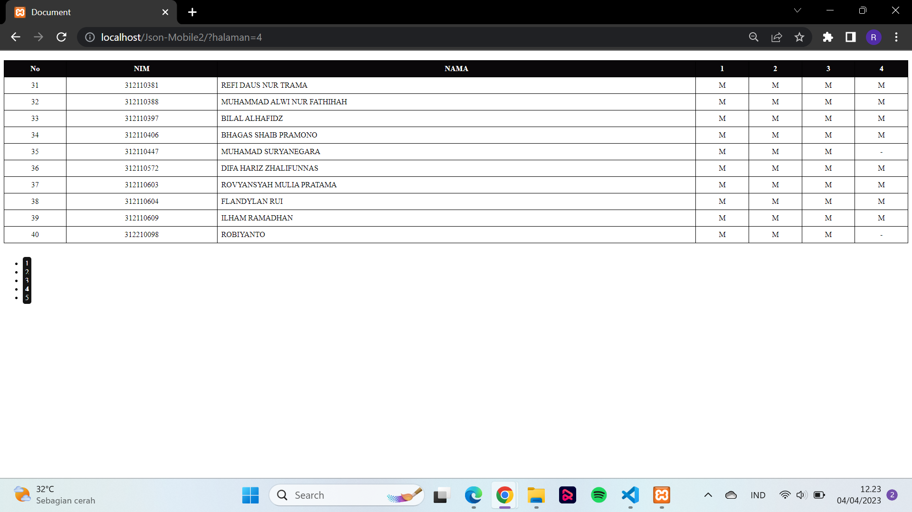

# TugasPemrogramanMobile
## Profil
| #               | Biodata           |
| --------------- | ----------------- |
| **Nama**        | Rezza Fauzi       |
| **NIM**         | 312110133         |
| **Kelas**       | TI.21.A.1         |
| **Mata Kuliah** | Pemrograman Mobile|

## File Index.php
```
<!DOCTYPE html>
<html lang="en">
<head>
    <meta charset="UTF-8">
    <meta http-equiv="X-UA-Compatible" content="IE=edge">
    <meta name="viewport" content="width=device-width, initial-scale=1.0">
    <title>Document</title>
    <link rel="stylesheet" type="text/css" href="style.css">
</head>
<body>
    <?php
    // Ambil data API
    $data = file_get_contents('https://api.steinhq.com/v1/storages/642a1ee5eced9b09e9c762e8/21a1');
    // Ubah data JSON menjadi array PHP
    $data = json_decode($data, true);
    $total_data = count($data);
    $jumlah_per_halaman = 10;
    $total_halaman = ceil($total_data / $jumlah_per_halaman);
    $halaman_aktif = (isset($_GET['halaman'])) ? $_GET['halaman'] : 1;
    $awal_data = ($jumlah_per_halaman * $halaman_aktif) - $jumlah_per_halaman;

    echo "<table border=''>";
    echo "<tr><th>No</th><th>NIM</th><th>NAMA</th><th>1</th><th>2</th><th>3</th><th>4</th></tr>";
    // Looping untuk menampilkan data dalam tabel
    $no = $awal_data + 1;
    for ($i=$awal_data; $i<$awal_data+$jumlah_per_halaman; $i++) {
        if (isset($data[$i])) {
            $item = $data[$i];

            echo "<tr>";
            echo "<td>" . $no."</td>";
            echo "<td>" . $item['NIM'] . "</td>";
            echo "<td>" . $item['Nama'] . "</td>";
            echo "<td>" . $item['1'] . "</td>";
            echo "<td>" . $item['2'] . "</td>";
            echo "<td>" . $item['3'] . "</td>";
            echo "<td>" . $item['4'] . "</td>";
            echo "</tr>";

            $no++;
        }
    }
    echo "</table>";

    echo "<br>";

    // Tampilkan pagination
    echo "<ul>";
    for ($i=1; $i<=$total_halaman; $i++) {
        if ($i == $halaman_aktif) {
            echo "<li><a href='?halaman=$i' style='font-weight:bold;'>$i</a></li>";
        } else {
            echo "<li><a href='?halaman=$i'>$i</a></li>";
        }
    }
    echo "</ul>";
    ?>
</body>
</html>
```
## File Style.css
```
/* Mengatur tampilan tabel */
table {
    border-collapse: collapse;
    width: 100%;
    margin-top: 20px;
  }
  
  th,
  td {
    text-align: center;
    padding: 8px;
  }
  
  th {
    background-color: #0a080a;
    color: white;
  }
  
  /* Mengatur tampilan kolom nama dan menjadikannya rata kiri */
  td:nth-child(3) {
    text-align: left;
  }
  
  /* Mengatur tampilan nomor urut dan kolom nilai menjadi rata tengah */
  td:nth-child(1),
  td:nth-child(n+4) {
    text-align: center;
  }
  
  /* Mengatur tampilan bagian navigasi */
  div {
    margin-top: 20px;
    display: flex; /* menambahkan properti display flex */
    justify-content: flex-end; /* menambahkan properti justify-content flex-end */
  }
  
  a {
    text-decoration: none;
    padding: 5px;
    background-color: #141414;
    color: white;
    border-radius: 5px;
    margin-right: 5px;
  }
  
  .pagination {
    display: inline-block;
    border: 1px solid #ccc;
    border-radius: 5px;
    margin: 20px auto;
  }
  
  .pagination a {
    color: black;
    float: left;
    padding: 8px 16px;
    text-decoration: none;
  }
  
  .pagination a.active {
    background-color: #4CAF50;
    color: white;
  }
  
  .pagination a:hover:not(.active) {background-color: #ddd;}
  
  /* Mengatur tampilan garis vertikal pada tabel */
  td,
  th {
  border: 1px solid black;
  }
```
## Output




